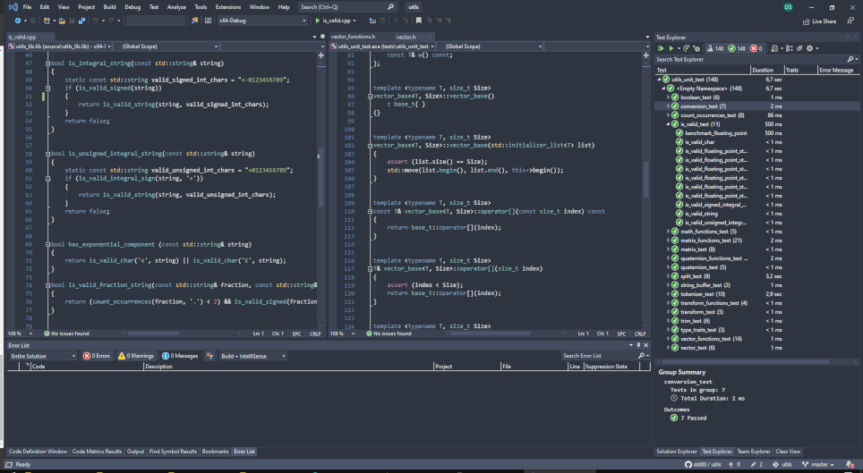

# Nordic

The Nordic project is an attempt to create the Nord Theme for Visual Studio 2019/2022. 

It is still in an early state (incorrect color pairings between foreground and background, etc).

The colors used for this theme can be found here https://www.nordtheme.com/.
But The use of colours is not based on the definitions, but rather corresponds to personal taste.

Some of the Visual Studio windows cannot be color adjusted. Therefore, these windows do not look like they belong together.

If you find an issue with this theme, please contact me so that we can improve the theme together, because the color definition of Nord is just awesome.

## What's changed

### Update V1.3.4:

Fixes:
* Adjust colors for Razor views.

### Update V1.3.3:

Fixes:
* Darker color for menu separators 
* Change inactive color in code navigation drop downs to make them more readable
* Modify "Diff Editor" colors get a better diff view. 

### Update V1.3.0:

Added:
* Visual Studio 2022 support

### Update V1.2.4:

Fixes
* fix some Resharper color settings (mostly background colors)

### Update V1.2.

Added:
* Colors for Jetbrains Resharper

Fixes:
* Border colors of tool window
* selection Colors
* Inlay hint color setting

## Thanks to 

* burki169
* Richard Moss
